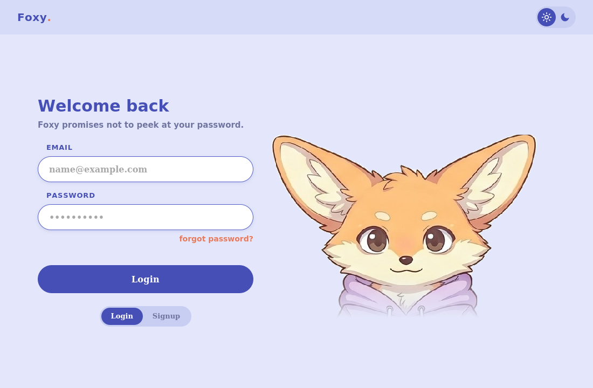
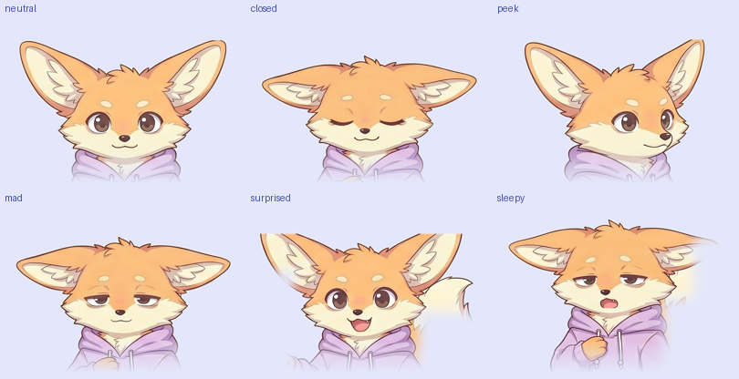
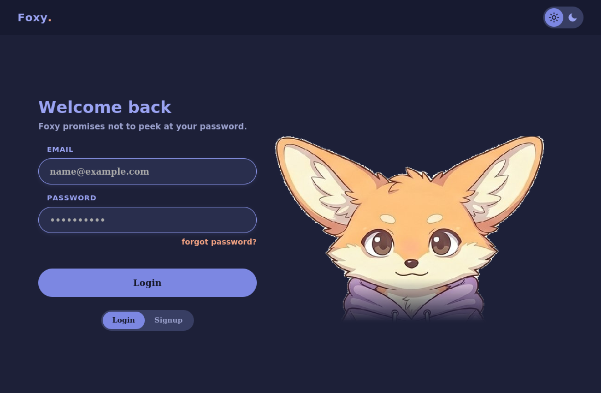

# 🦊 Foxy — an animated fox login screen

A self-contained, single-file login page with an expressive fennec-fox mascot who **reacts to what you do**: she blinks, gets sleepy when you're away, covers her eyes when you type your password, side-eyes you on Caps Lock, sulks on a wrong password, and celebrates a correct one. Everything (artwork + code) is baked into one `.html` file, so it runs offline with a double-click.



## ✨ Features

- **Reactive character** — six hand-aligned expressions that crossfade smoothly into one another.
- **Idle life** — random blinking (with the occasional double-blink), a periodic glance, and a sleepy state after 10s of inactivity.
- **Password etiquette** — she closes her eyes while you type, and side-eyes you when Caps Lock is on.
- **Login feedback** — wrong password = grumpy + shake; correct password = a happy "welcome" reveal.
- **Light & dark themes** — periwinkle by day, deep indigo by night.
- **One file, no dependencies** — images are embedded; works offline, hosts anywhere.

### Expressions & what triggers them



### Dark mode



## 🚀 Run it

Just **double-click `foxy-login.html`** — it opens in your browser. That's it.

To host it online instead, drop the file on [Netlify Drop](https://app.netlify.com/drop) or enable GitHub Pages on this repo.

## 🔑 Set the password

Open `foxy-login.html` in any text editor and edit these lines near the top of the `<script>`:

```js
const AUTH = { email:"friend@home", password:"changeme" };
const WELCOME_TITLE = "Welcome back!";
const WELCOME_MSG   = "The computer's all yours. Have a great day!";
```

Save, reload. Done.

## 🖥️ Make it greet you at startup (Windows)

This turns the page into a fullscreen "lock screen" that opens automatically when you log in.

1. Put **`foxy-login.html`** and **`Start-Foxy.bat`** in the **same folder**.
2. Double-click `Start-Foxy.bat` to test — the fox fills the screen. (Press `Alt`+`F4` to exit.)
3. Right-click `Start-Foxy.bat` → **Create shortcut**.
4. Press `Win`+`R`, type `shell:startup`, press Enter, and drop the shortcut into that folder.
5. Now Foxy greets you every time you log into Windows. Correct password → welcome screen → it closes.

**To remove:** delete the shortcut from the `shell:startup` folder.

> ⚠️ **This is a decorative greeting, not real security.** It appears *after* the normal Windows login and can be dismissed with `Esc` / `Alt`+`Tab` / `Alt`+`F4`. Your actual account password still protects the computer. Treat this as a fun gift, not a lock.

## 🎨 Customize

| What | Where |
|------|-------|
| Colors (light) | `:root { … }` in the `<style>` |
| Colors (dark) | `[data-theme="dark"] { … }` |
| Which face maps to which state | the `FRAME_OF` object in the `<script>` |
| Blink frequency / double-blink chance | `scheduleBlink()` and the `0.22` in `doBlink()` |
| Idle-to-sleepy delay | the `10000` in `startIdleTimer()` |

## 🦊 Credits

Character artwork generated for this project; code is free to use and modify.
